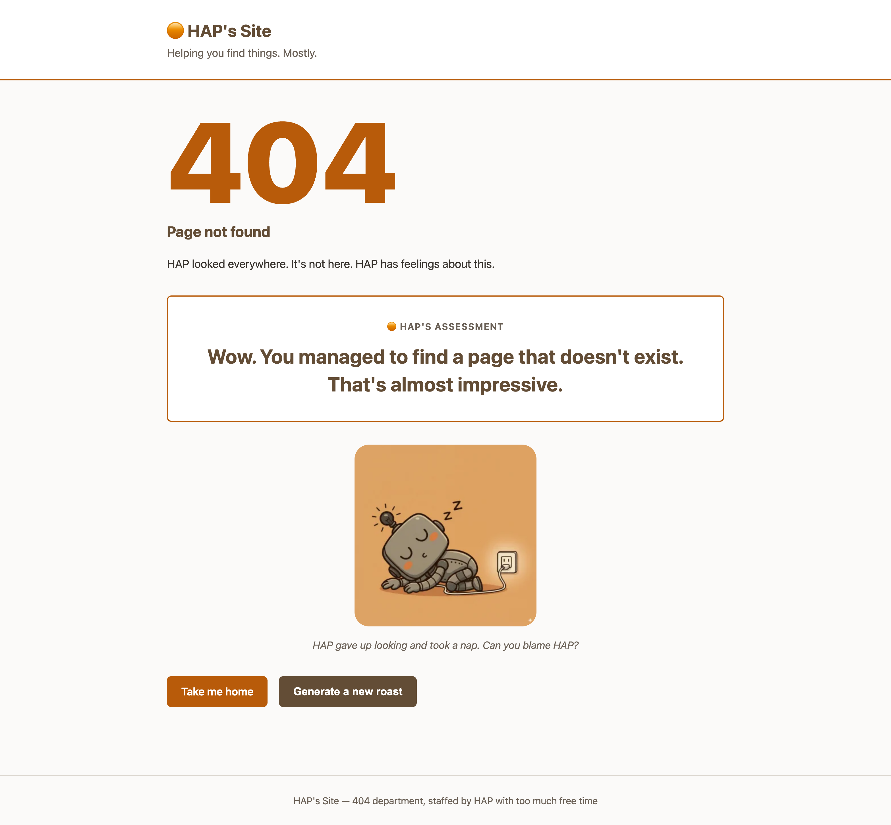

# HAP's silly 404

[](https://hap-silly-404.netlify.app)

A proof of concept site demonstrating how to call a chat model from a serverless function with basic safety guardrails in place.



> [!tip]
> **Want to go straight to the 404?** [hap-silly-404.netlify.app/404](https://hap-silly-404.netlify.app/404)

The site has a custom 404 page that fetches a witty roast from an AI model every time someone lands on a page that does not exist. A random HAP robot pose appears alongside each roast for visual flair.

## How it works

1. A visitor hits any route that does not exist
2. Netlify serves `404.html`, which calls `/.netlify/functions/insult`
3. The serverless function picks a random creative angle, sends it to the Groq API, and returns a one-liner roast
4. If the API is unavailable or rate-limited, a hardcoded fallback insult is returned instead
5. A random HAP pose is pulled from Cloudinary and displayed alongside the roast

## Safety guardrails demonstrated

- **Rate limiting** — the function exports a Netlify rate limit config (10 requests per IP per 60 seconds)
- **Content moderation** — a system message constrains the model to clean, family-friendly output
- **CORS** — responses include `Access-Control-Allow-Origin` locked to the site domain in production
- **Security headers** — `X-Frame-Options`, `X-Content-Type-Options`, and `Referrer-Policy` set via `netlify.toml`
- **Graceful fallback** — every failure path (no API key, rate limit, network error) returns a hardcoded response so the page always works
- **Safe rendering** — all dynamic content is inserted with `textContent`, never `innerHTML`

## Setup

### Prerequisites

- A [Netlify](https://www.netlify.com/) account
- A [Groq](https://console.groq.com/) API key (free tier works)

### Environment variables

Set these in the Netlify dashboard under **Site configuration > Environment variables**:

- `GROQ_API_KEY` — your Groq API key (required for live roasts)
- `GROQ_MODEL` — model ID (optional, defaults to `llama-3.3-70b-versatile`)

For local development, create a `.env` file in the project root:

```bash
GROQ_API_KEY=your-key-here
```

### Local development

```bash
netlify dev
```

Visit `http://localhost:8888/this-page-does-not-exist` to trigger the 404 page.

## Tech stack

- Vanilla HTML, CSS, and JavaScript
- Netlify Functions (serverless, ES modules)
- Groq API (LLM inference)
- Cloudinary (image hosting)

## Contributing

Contributions are welcome. Please open an issue first to discuss what you would like to change.

## License

[MIT](https://choosealicense.com/licenses/mit/) - Cynthia Teeters
